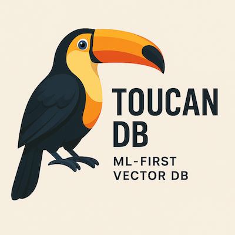

# 🦜 ToucanDB - Micro ML-First Vectorial DB Engine

**A Secure, Efficient ML-First Vector Database Engine**



[](https://www.python.org/downloads/)
[](https://opensource.org/licenses/MIT)
[](https://github.com/pH-7/ToucanDB/tree/main/tests)
[](https://github.com/pH-7/ToucanDB)
[](https://github.com/pH-7/ToucanDB)

ToucanDB is a modern, security-first vector database designed specifically for ML workloads. Named after the vibrant toucan bird known for its precision and adaptability, ToucanDB brings the same qualities to vector similarity search and storage.

## � Perfect for LLM Applications

ToucanDB excels at **storing unstructured data as high-dimensional vector embeddings**, making it incredibly powerful for:

- **🔍 Semantic Search**: Transform text, images, audio into vectors and find similar content instantly
- **🤖 RAG (Retrieval-Augmented Generation)**: Provide LLMs with relevant context from your knowledge base
- **📚 Document Retrieval**: Store and query millions of documents by semantic meaning, not just keywords
- **💬 Conversational AI**: Build chatbots that understand context and retrieve relevant information
- **🎨 Multimodal Search**: Find similar images, videos, or audio files using vector representations

### Why Vector Embeddings?
Traditional databases store structured data (rows, columns). ToucanDB stores **unstructured data as vectors** - mathematical representations that capture semantic meaning. This allows you to:

✅ **Find similar objects quickly** - even when they don't share exact keywords
✅ **Scale to billions of vectors** - with sub-millisecond search times  
✅ **Support any data type** - text, images, audio, video, code, etc.  
✅ **Enable AI applications** - perfect for LLMs, recommendation systems, and ML pipelines  

## �🌟 Key Features

### 🔒 Security-First Design
- **End-to-end encryption** with AES-256-GCM
- **Zero-trust architecture** with granular access controls
- **Audit logging** for compliance and monitoring
- **Memory-safe operations** to prevent data leaks

### ⚡ High Performance
- **SIMD-optimized** vector operations
- **Adaptive indexing** with HNSW and IVF algorithms
- **Intelligent caching** with LRU and frequency-based eviction
- **Async I/O** for concurrent operations

### 🧠 ML-Native Features
- **Multi-model support** for various embedding types
- **Automatic quantization** (FP16, INT8) for memory efficiency
- **Vector clustering** and dimensionality reduction
- **Real-time inference** integration

### 🎯 Developer Experience
- **Simple Python API** with async support
- **Type-safe** operations with Pydantic schemas
- **Comprehensive testing** and documentation
- **Docker support** for easy deployment

## 🚀 Quick Start

### Basic Example: Storing Text Documents as Vectors

```python
import asyncio
from toucandb import ToucanDB, VectorSchema

async def main():
    # Initialize database with encryption
    db = await ToucanDB.create("./knowledge_base.tdb", encryption_key="your-secret-key")
    
    # Define schema for text embeddings (e.g., from OpenAI, Sentence Transformers)
    schema = VectorSchema(
        name="documents",
        dimensions=384,  # Common embedding size
        metric="cosine",  # Best for semantic similarity
        index_type="hnsw"  # Fast approximate search
    )
    
    # Create collection
    collection = await db.create_collection(schema)
    
    # Store unstructured data as vectors
    documents = [
        {
            "id": "doc1", 
            "vector": [0.1, 0.2, 0.3, ...],  # Embedding from your model
            "metadata": {
                "title": "Introduction to Machine Learning",
                "content": "Machine learning is a subset of artificial intelligence...",
                "category": "AI/ML",
                "timestamp": "2024-01-15"
            }
        },
        {
            "id": "doc2", 
            "vector": [0.3, 0.4, 0.1, ...],  # Another document embedding
            "metadata": {
                "title": "Deep Learning Fundamentals", 
                "content": "Deep learning uses neural networks with many layers...",
                "category": "AI/ML",
                "timestamp": "2024-01-16"
            }
        },
    ]
    
    # Insert documents (bulk operation for efficiency)
    await collection.insert_many(documents)
    
    # Semantic search: Find similar documents
    query_vector = [0.15, 0.25, 0.2, ...]  # User query embedding
    results = await collection.search(
        query_vector, 
        k=5,           # Return top 5 matches
        threshold=0.7   # Minimum similarity score
    )
    
    # Process results for LLM context
    for result in results:
        print(f"📄 {result.metadata['title']}")
        print(f"🎯 Similarity: {result.score:.3f}")
        print(f"📝 Content: {result.metadata['content'][:100]}...")
        print("---")

# Run the example
asyncio.run(main())
```

### Integration with LLMs

```python
# Example: RAG system with ToucanDB + OpenAI
async def rag_query(user_question: str):
    # 1. Convert question to vector
    question_embedding = await get_embedding(user_question)
    
    # 2. Search relevant documents
    relevant_docs = await collection.search(question_embedding, k=3)
    
    # 3. Build context for LLM
    context = "\n".join([doc.metadata['content'] for doc in relevant_docs])
    
    # 4. Query LLM with context
    prompt = f"Context: {context}\n\nQuestion: {user_question}\nAnswer:"
    response = await openai.chat.completions.create(
        model="gpt-4",
        messages=[{"role": "user", "content": prompt}]
    )
    
    return response.choices[0].message.content
```

## 📦 Installation

```bash
# Basic installation
pip install toucandb

# With GPU support
pip install toucandb[gpu]

# Development installation
pip install toucandb[dev]
```

## 🏗️ Architecture

ToucanDB is built on a modular architecture:

```
┌─────────────────┐    ┌─────────────────┐    ┌─────────────────┐
│   Client API    │    │  Security Layer │    │  Query Engine   │
│                 │    │                 │    │                 │
│ • Python SDK    │    │ • Encryption    │    │ • Vector Search │
│ • Async Support │    │ • Access Control│    │ • Filtering     │
│ • Type Safety   │    │ • Audit Logs    │    │ • Aggregation   │
└─────────────────┘    └─────────────────┘    └─────────────────┘
         │                       │                       │
         └───────────────────────┼───────────────────────┘
                                 │
┌─────────────────┐    ┌─────────────────┐    ┌─────────────────┐
│  Index Engine   │    │  Storage Engine │    │  Memory Manager │
│                 │    │                 │    │                 │
│ • HNSW/IVF      │    │ • Compressed    │    │ • Smart Caching │
│ • Auto-tuning   │    │ • Transactional │    │ • Memory Pools  │
│ • Multi-metric  │    │ • Backup/Restore│    │ • Garbage Collection │
└─────────────────┘    └─────────────────┘    └─────────────────┘
```

## 🔧 Configuration

ToucanDB supports extensive configuration options:

```python
config = {
    "storage": {
        "compression": "lz4",
        "encryption": "aes-256-gcm",
        "backup_interval": 3600
    },
    "indexing": {
        "algorithm": "hnsw",
        "ef_construction": 200,
        "m": 16,
        "auto_optimize": True
    },
    "memory": {
        "cache_size": "1GB",
        "memory_map": True,
        "preload": False
    }
}

db = await ToucanDB.create("./db", config=config)
```

## 🧪 Use Cases

### 🤖 LLM & AI Applications
- **RAG Systems**: Knowledge bases for Large Language Models
- **Semantic Search**: Find documents by meaning, not just keywords
- **Conversational AI**: Context-aware chatbots and virtual assistants
- **Content Recommendation**: Suggest similar articles, products, or media

### 📊 ML & Data Science
- **Similarity Search**: Find similar images, documents, or data points
- **Anomaly Detection**: Identify outliers in high-dimensional data
- **Clustering & Classification**: Group similar items automatically
- **Feature Stores**: Centralized storage for ML model features

### 🏢 Enterprise Applications
- **Document Management**: Semantic search across corporate knowledge
- **Customer Support**: Intelligent ticket routing and knowledge retrieval
- **E-commerce**: Product recommendations and visual search
- **Content Moderation**: Detect similar or duplicate content automatically

## 🛡️ Security Features

### Encryption
- All data encrypted at rest and in transit
- Key rotation and management
- Hardware security module (HSM) support

### Access Control
- Role-based permissions
- API key authentication
- Network-level security

### Compliance
- GDPR-compliant data handling
- SOC 2 Type II controls
- Comprehensive audit trails

## 📈 Performance

ToucanDB is designed for high performance:

- **Throughput**: 100K+ vectors/second ingestion
- **Latency**: Sub-millisecond search response times
- **Scale**: Billions of vectors with horizontal scaling
- **Memory**: Optimized memory usage with smart compression

## 🦜 Why "ToucanDB"?

Just like the vibrant toucan bird, ToucanDB embodies the perfect combination of **precision, adaptability, and intelligence** that makes it exceptional for ML applications.


### The Toucan Inspiration

🎯 **Precision**: Toucans have incredibly precise beaks that can reach exactly where they need to go - just like ToucanDB's vector search that finds exactly the right data points with sub-millisecond accuracy.

🔄 **Adaptability**: These remarkable birds adapt to diverse environments and data sources - mirroring how ToucanDB seamlessly handles any type of unstructured data (text, images, audio, code).

🧠 **Intelligence**: Toucans are highly intelligent creatures with excellent memory - reflecting ToucanDB's smart caching, adaptive indexing, and ML-first design that learns and optimizes performance.

🌈 **Vibrancy**: The toucan's colorful nature represents ToucanDB's rich feature set and the diverse, multimodal data it can process and understand.

Just as toucans navigate complex forest ecosystems with ease, ToucanDB navigates the complex landscape of high-dimensional vector spaces, making ML applications soar! 🚀

## 👨‍💻 Who Built This Vector Database Engine?

**Pierre-Henry Soria** — a **super passionate engineer** who loves building cutting-edge AI infrastructure and automating intelligent systems efficiently!
Enthusiast of Machine Learning, Vector Databases, AI, and—of course—writing performant code!
Find me at [pH7.me](https://ph7.me)

Enjoying this project? **[Buy me a coffee](https://ko-fi.com/phenry)** (spoiler: I love almond extra-hot flat white coffees while coding ML algorithms).

[](https://ph7.me "Pierre-Henry Soria's personal website")

[![@phenrysay][x-icon]](https://x.com/phenrysay "Follow Me on X") [![YouTube Tech Videos][youtube-icon]](https://www.youtube.com/@pH7Programming "My YouTube Tech Channel") [![pH-7][github-icon]](https://github.com/pH-7 "Follow Me on GitHub")

## 🤝 Contributing

We welcome contributions! Please see our [Contributing Guide](CONTRIBUTING.md) for details.

## 📄 License

ToucanDB is released under the MIT License. See [license](license.md) for further details.

## 🎯 Roadmap

- [ ] Distributed clustering support
- [ ] Real-time streaming updates
- [ ] Multi-modal search (text + image)
- [ ] Integration with popular ML frameworks
- [ ] Cloud-native deployment options
- [ ] GraphQL API support

---

**Built with ❤️ for the AI community**

<!-- GitHub's Markdown reference links -->
[x-icon]: https://img.shields.io/badge/x-000000?style=for-the-badge&logo=x
[github-icon]: https://img.shields.io/badge/GitHub-100000?style=for-the-badge&logo=github&logoColor=white
[youtube-icon]: https://img.shields.io/badge/YouTube-FF0000?style=for-the-badge&logo=youtube&logoColor=white
